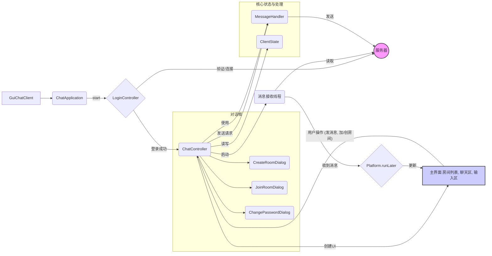

# JavaFX GUI 聊天客户端 README

这个项目包含一个使用 JavaFX 构建的图形用户界面 (GUI) 聊天客户端，旨在提供比命令行版本更直观、更友好的用户体验。

## 功能特性

### GUI 界面特性
- **用户友好的登录界面**：启动时弹出登录对话框，要求输入用户名、服务器地址和端口。
- **现代化的主界面**：采用 `BorderPane` 布局，包含：
    - **顶部菜单栏**：提供"创建房间"和"修改房间密码"等操作。
    - **左侧房间列表**：使用 `ListView` 显示所有可用房间，当前加入的房间会以蓝色背景高亮显示。双击可加入房间。
    - **右侧聊天区域**：
        - 上方使用 `TextFlow` 在 `ScrollPane` 中显示聊天记录，支持不同颜色和样式的文本。
        - 下方是 `TextArea` 消息输入框和"发送" `Button`。
- **字体设计**：全局优先使用 Noto Sans SC 字体，以优化中文显示效果。
- **实时更新**：
    - 自动获取并更新房间列表。
    - 实时显示当前房间的聊天消息。
    - 显示用户加入/离开房间的系统通知。
- **响应式布局**：支持窗口大小调整，并设置了最小窗口尺寸 (800x600)。

### 对话框功能
基于 JavaFX `Dialog` 实现，提供模态交互：
1.  **登录对话框 (`LoginController`)**
    - 输入用户名（仅支持字母、数字、下划线）。
    - 配置服务器地址和端口（提供默认值）。
    - 对输入格式进行实时验证。
    - 连接服务器并处理登录逻辑，显示连接或登录错误信息。
2.  **创建房间对话框 (`CreateRoomDialog`)**
    - 输入房间名称（必填，仅支持字母、数字、下划线）。
    - 可选设置房间密码（格式同上）。
    - 实时验证输入格式。
3.  **加入房间对话框 (`JoinRoomDialog`)**
    - 双击房间列表中的房间名触发。
    - 如果房间需要密码，则要求输入密码。
4.  **修改房间密码对话框 (`ChangePasswordDialog`)**
    - 通过菜单栏触发。
    - 仅对当前加入房间的创建者有效。
    - 可设置新密码或通过留空来取消密码保护。
5.  **错误/信息提示 (`AlertUtil`)**
    - 使用标准的 `Alert` 对话框显示操作结果或错误信息。

### 消息显示
- **消息格式**：`[时间 HH:mm:ss] 用户名: 消息内容`。
- **系统消息**：如用户进入/离开房间的提醒，以特定颜色（例如橙色）和"[系统]"前缀显示。
- **自动滚动**：聊天区域在新消息到达时自动滚动到底部。

## GUI 客户端架构概述



1.  **启动**: [`GuiChatClient`](src/main/java/com/example/chat/client/gui/GuiChatClient.java:8) 启动 JavaFX 应用 [`ChatApplication`](src/main/java/com/example/chat/client/gui/ChatApplication.java:23)。
2.  **登录**: [`ChatApplication`](src/main/java/com/example/chat/client/gui/ChatApplication.java:23) 显示 [`LoginController`](src/main/java/com/example/chat/client/gui/controller/LoginController.java:35) 管理的登录对话框。[`LoginController`](src/main/java/com/example/chat/client/gui/controller/LoginController.java:35) 处理用户输入、连接服务器、发送登录请求并处理响应。
3.  **主界面**: 登录成功后，[`LoginController`](src/main/java/com/example/chat/client/gui/controller/LoginController.java:35) 将创建好的 [`ClientState`](src/main/java/com/example/chat/client/ClientState.java:18) 和 [`MessageHandler`](src/main/java/com/example/chat/client/MessageHandler.java:17) 传递给 [`ChatController`](src/main/java/com/example/chat/client/gui/controller/ChatController.java:29)。[`ChatController`](src/main/java/com/example/chat/client/gui/controller/ChatController.java:29) 负责构建和管理主聊天界面。
4.  **消息接收**: [`ChatController`](src/main/java/com/example/chat/client/gui/controller/ChatController.java:29) 启动一个后台线程，该线程阻塞等待从服务器读取 [`Message`](src/main/java/com/example/chat/common/Message.java:19) 对象。
5.  **UI 更新**: 收到消息后，后台线程使用 `Platform.runLater()` 将消息处理逻辑（如更新聊天显示、房间列表）提交到 JavaFX 应用线程执行，确保线程安全。
6.  **用户交互**: 用户在界面上的操作（如发送消息、点击房间、使用菜单）由 [`ChatController`](src/main/java/com/example/chat/client/gui/controller/ChatController.java:29) 处理。需要与服务器交互的操作会构建相应的 [`Message`](src/main/java/com/example/chat/common/Message.java:19) 对象，并通过 [`MessageHandler`](src/main/java/com/example/chat/client/MessageHandler.java:17) 发送出去。

## 编译和运行

### 1. 编译项目
使用 Maven 进行编译：
```bash
mvn clean package
```
编译完成后会生成三个 jar 文件在 `target/` 目录下：
- `chat-server.jar` - 服务器端
- `chat-client.jar` - 命令行客户端
- `chat-gui-client.jar` - **GUI 客户端**

### 2. 启动服务器
（需要先启动服务器）
```bash
# Linux/macOS
java -jar target/chat-server.jar [port]

# Windows (推荐，解决中文乱码)
java -Dfile.encoding=UTF-8 -Dconsole.encoding=UTF-8 -jar target/chat-server.jar [port]
```
默认端口是 8888。

### 3. 启动 GUI 客户端
```bash
# Linux/macOS/Windows
java -jar target/chat-gui-client.jar
```
**注意:** 运行 GUI 客户端通常不需要 `-Dfile.encoding` 参数，JavaFX 内部对字符编码有更好的处理。但确保你的系统安装了 JavaFX 运行时环境。如果使用 OpenJDK，可能需要单独下载和配置 JavaFX SDK。

### 4. 使用 Maven 插件运行（开发环境）
```bash
# 运行 GUI 客户端 (推荐)
mvn javafx:run

# 运行服务器 (在另一个终端)
mvn exec:java -Dexec.mainClass="com.example.chat.server.ChatServer"

# 运行命令行客户端 (可选，在另一个终端)
mvn exec:java -Dexec.mainClass="com.example.chat.client.shell.ChatClient"
```

## 使用说明

### 第一次使用
1.  按照上述步骤启动服务器。
2.  启动 GUI 客户端。
3.  在弹出的登录对话框中输入一个唯一的用户名（字母、数字、下划线）。服务器地址和端口通常保持默认 (`localhost:8888`)，除非服务器运行在不同机器或端口上。
4.  点击"OK"按钮登录。

### 聊天操作
1.  **创建房间**: 使用顶部菜单栏的"房间操作" -> "创建房间"。输入房间名和可选的密码。创建成功后会自动加入该房间。
2.  **加入房间**: 在左侧房间列表中双击想要加入的房间名称。如果房间有密码，会弹出对话框要求输入密码。
3.  **发送消息**: 加入房间后，在右下角的文本框中输入消息，按 `Enter` 键或点击"发送"按钮。
4.  **修改密码**: 如果你是当前房间的创建者，可以使用菜单栏的"房间操作" -> "修改房间密码"。
5.  **离开房间**: 加入另一个房间会自动离开当前房间。目前没有单独的"离开房间"按钮，可以通过加入其他房间或关闭客户端实现离开。

### 房间管理
- 只有房间创建者可以修改房间密码。
- 房间在最后一个用户离开后会被服务器自动销毁。
- 系统会实时显示用户加入/离开当前房间的消息。

## 技术栈与关键类

- **UI 框架**: JavaFX 21
- **构建工具**: Maven
- **核心 UI 控制器**:
    - [`ChatApplication`](src/main/java/com/example/chat/client/gui/ChatApplication.java:23): JavaFX 应用入口。
    - [`LoginController`](src/main/java/com/example/chat/client/gui/controller/LoginController.java:35): 处理登录逻辑和界面。
    - [`ChatController`](src/main/java/com/example/chat/client/gui/controller/ChatController.java:29): 管理主聊天界面。
- **辅助类**:
    - [`ClientState`](src/main/java/com/example/chat/client/ClientState.java:18): 维护客户端状态（连接、用户名、当前房间等）。
    - [`MessageHandler`](src/main/java/com/example/chat/client/MessageHandler.java:17): 封装发送消息到服务器的逻辑。
    - [`AlertUtil`](src/main/java/com/example/chat/client/gui/util/AlertUtil.java:12): 显示标准弹窗。
    - Dialogs: [`CreateRoomDialog`](src/main/java/com/example/chat/client/gui/controller/CreateRoomDialog.java:16), [`JoinRoomDialog`](src/main/java/com/example/chat/client/gui/controller/JoinRoomDialog.java:14), [`ChangePasswordDialog`](src/main/java/com/example/chat/client/gui/controller/ChangePasswordDialog.java:14)。
- **样式**: 通过 CSS 文件 (`src/main/resources/css/chat.css`) 定义界面样式。

## 兼容性说明

- 该 GUI 客户端与项目中的命令行客户端完全兼容。
- 可以同时运行多个 GUI 客户端和命令行客户端连接到同一个服务器。
- 服务器端无需任何修改即可支持 GUI 客户端。
- 不同类型的客户端之间可以正常通信（例如，GUI 用户可以看到 Shell 用户发送的消息，反之亦然）。

## 系统要求

- Java 21 或更高版本。
- JavaFX 21 SDK 或运行时环境（如果使用 OpenJDK，需要确保 JavaFX 模块可用）。
- 操作系统最好支持 Noto Sans SC 字体以获得最佳显示效果（但不是强制要求）。