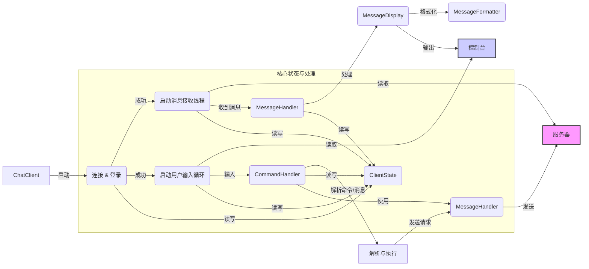

# WebChat - Java Shell 聊天客户端 README

这是 WebChat 项目的命令行 (Shell) 客户端实现。它提供了一个基于文本的界面，允许用户通过输入命令与聊天服务器进行交互。

## 主要功能

- **用户认证**: 使用唯一的用户名登录服务器。
- **聊天室系统**:
    - 创建聊天室（可设置密码）。
    - 加入/离开聊天室。
    - 在当前加入的聊天室中发送和接收消息。
    - 查看可用聊天室列表。
    - 查看当前聊天室的详细信息（创建者、成员列表）。
    - 获取房间的近期聊天历史。
    - 修改房间密码（仅限房间创建者）。
- **私聊消息**: 向指定的在线用户发送私人消息。
- **用户管理**: 查看当前所有在线用户列表。
- **命令行界面**: 通过一系列以 `/` 开头的命令执行操作。
- **彩色输出**: 使用 ANSI 转义码在支持的终端中提供彩色输出，区分不同类型的消息（系统消息、房间消息、私聊消息、错误提示等）。

## 技术特点

- **基于 Java Socket**: 使用 TCP/IP 进行可靠的网络通信。
- **对象序列化**: 通过 `ObjectInputStream` 和 `ObjectOutputStream` 传输自定义的 `Message` 对象。
- **并发**: 使用单独的后台线程接收服务器消息，避免阻塞主线程的用户输入。
- **命令驱动**: 通过 [`CommandHandler`](src/main/java/com/example/chat/client/shell/CommandHandler.java:17) 解析和处理用户输入的命令。
- **消息处理**: 通过 [`MessageHandler`](src/main/java/com/example/chat/client/MessageHandler.java:17) 处理从服务器接收到的各类消息。
- **格式化输出**: [`MessageFormatter`](src/main/java/com/example/chat/client/shell/MessageFormatter.java:10) 和 [`MessageDisplay`](src/main/java/com/example/chat/client/shell/MessageDisplay.java:9) 负责将消息格式化并以彩色文本显示在控制台。
- **优雅关闭**: 支持通过 `Ctrl+C` 或 `/exit` 命令安全退出，并通知服务器。

## Shell 客户端架构概述



1.  **启动与连接**: [`ChatClient`](src/main/java/com/example/chat/client/shell/ChatClient.java:22) 类是入口点。它负责解析命令行参数（服务器地址和端口），初始化 [`ClientState`](src/main/java/com/example/chat/client/ClientState.java:18)，然后尝试连接到服务器并建立 Socket 连接和对象流。
2.  **登录**: 连接成功后，程序提示用户输入用户名。客户端发送登录请求到服务器，并等待响应。如果用户名被占用或发生其他错误，会提示用户重新输入。登录成功后，[`ClientState`](src/main/java/com/example/chat/client/ClientState.java:18) 中会保存用户名。
3.  **消息接收**: 登录成功后，[`ChatClient`](src/main/java/com/example/chat/client/shell/ChatClient.java:22) 会启动一个后台守护线程。该线程持续阻塞读取从服务器通过 `ObjectInputStream` 发送过来的 [`Message`](src/main/java/com/example/chat/common/Message.java:19) 对象。
4.  **消息处理与显示**: 接收线程将读取到的消息交给 [`MessageHandler`](src/main/java/com/example/chat/client/MessageHandler.java:17) 处理。[`MessageHandler`](src/main/java/com/example/chat/client/MessageHandler.java:17) 根据消息类型更新 [`ClientState`](src/main/java/com/example/chat/client/ClientState.java:18)（例如，设置当前房间名）或调用 [`MessageDisplay`](src/main/java/com/example/chat/client/shell/MessageDisplay.java:9) 来显示消息。[`MessageDisplay`](src/main/java/com/example/chat/client/shell/MessageDisplay.java:9) 内部使用 [`MessageFormatter`](src/main/java/com/example/chat/client/shell/MessageFormatter.java:10) 将消息对象转换为带 ANSI 颜色代码的字符串，然后输出到控制台。
5.  **用户输入**: 同时，主线程进入一个循环，等待用户在控制台输入。
6.  **命令处理**: 用户输入后，内容被传递给 [`CommandHandler`](src/main/java/com/example/chat/client/shell/CommandHandler.java:17)。如果输入以 `/` 开头，[`CommandHandler`](src/main/java/com/example/chat/client/shell/CommandHandler.java:17) 会解析命令和参数，并执行相应的操作（例如，构建并发送一个加入房间的 [`Message`](src/main/java/com/example/chat/common/Message.java:19)）。如果输入不是命令，则将其视为普通聊天消息，发送到用户当前所在的聊天室。
7.  **消息发送**: 需要与服务器交互的操作（发送命令请求或聊天消息）会通过 [`MessageHandler`](src/main/java/com/example/chat/client/MessageHandler.java:17) 的 `sendMessage` 方法将 [`Message`](src/main/java/com/example/chat/common/Message.java:19) 对象写入 `ObjectOutputStream` 发送给服务器。

## 安装和运行

### 系统要求
- Java 21 或更高版本。
- Maven 3.6 或更高版本（用于构建）。
- 一个支持 ANSI 颜色代码的终端（大多数现代终端都支持，如 Linux/macOS 的默认终端, Windows Terminal, Git Bash 等）。

### 构建项目
在项目根目录（包含 `pom.xml` 的目录）运行：
```bash
mvn clean package
```
这将生成 `target/chat-client.jar` 文件。

### 运行服务器
（需要先启动服务器）
```bash
# Linux/macOS
java -jar target/chat-server.jar [port]

# Windows (推荐，解决中文乱码)
java -Dfile.encoding=UTF-8 -Dconsole.encoding=UTF-8 -jar target/chat-server.jar [port]
```
默认端口是 8888。

### 运行 Shell 客户端
```bash
# Linux/macOS
java -jar target/chat-client.jar [host] [port]

# Windows (推荐，解决中文乱码)
java -Dfile.encoding=UTF-8 -Dconsole.encoding=UTF-8 -jar target/chat-client.jar [host] [port]
```
- `[host]` (可选): 服务器地址，默认为 `localhost`。
- `[port]` (可选): 服务器端口，默认为 `8888`。

### 中文显示问题解决 (Windows)
如果在 Windows 命令提示符 (cmd.exe) 或 PowerShell 中遇到中文乱码：
1.  **设置控制台代码页为 UTF-8**: 在运行 `java` 命令前，先执行 `chcp 65001`。
2.  **使用推荐的启动参数**: `java -Dfile.encoding=UTF-8 -Dconsole.encoding=UTF-8 -jar target/chat-client.jar`。
3.  **推荐使用 Windows Terminal**: 它对 UTF-8 和 ANSI 颜色的支持通常更好。

## 客户端命令详解

在客户端运行后，你可以输入以下命令来执行操作：

| 命令                          | 参数                     | 描述                                                                 |
| :---------------------------- | :----------------------- | :------------------------------------------------------------------- |
| `/help`                       | (无)                     | 显示所有可用命令及其说明。                                             |
| `/clear`                      | (无)                     | 清除终端屏幕内容。                                                   |
| `/exit`                       | (无)                     | 向服务器发送登出请求，并安全退出客户端。                               |
| `/list`                       | (无)                     | 请求并显示当前所有在线的用户列表。                                     |
| `/rooms`                      | (无)                     | 请求并显示服务器上所有可用的聊天室列表。                               |
| `/create-room`                | `room-name` `<password>` | 创建一个新的聊天室。`room-name` 是必需的，`<password>` 是可选的密码。 |
| `/join`                       | `room-name` `<password>` | 加入一个已存在的聊天室。如果房间有密码，需要提供 `<password>`。        |
| `/passwd`                     | `room-name` `<new-pass>` | 修改指定房间的密码。只有该房间的创建者才能执行。`<new-pass>` 留空则取消密码保护。 |
| `/leave`                      | (无)                     | 离开当前所在的聊天室。                                               |
| `/room-info`                  | (无)                     | 请求并显示当前所在聊天室的详细信息，包括创建者和成员列表。             |
| `/pm`                         | `<username>` `<message>` | 向指定的在线用户 `<username>` 发送私聊消息 `<message>`。             |
| *(无命令，直接输入文本)*        | `message text`           | 在当前加入的聊天室中发送公开消息。如果未加入任何房间，会收到提示。     |

**注意:**
- 命令和参数之间用空格分隔。
- 房间名、用户名和密码只能包含大小写字母、数字和下划线 (`^[a-zA-Z0-9_]+$`)。
- 如果命令需要密码但房间没有密码，则省略密码参数。

## 兼容性

Shell 客户端与 GUI 客户端完全兼容，可以连接到同一个服务器并相互通信。

## 许可证

本项目使用 GPLv3 许可证。详情请参阅项目根目录下的 [LICENSE](LICENSE) 文件。
