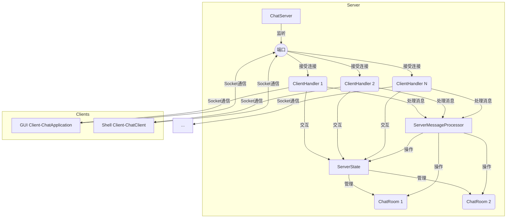

# WebChat 项目设计说明文档

## 1. 项目概述

WebChat 是一个基于 Java 实现的客户端-服务器架构的聊天应用程序。它支持多用户同时在线，提供公共聊天室功能，并允许用户创建和加入带密码保护的房间。项目包含两种客户端实现：一个基于 JavaFX 的图形用户界面 (GUI) 客户端和一个基于命令行的 Shell 客户端。

**主要功能:**

*   用户登录与注册（当前实现为基于内存的用户名唯一性检查）
*   创建、加入、离开聊天室
*   公共聊天室消息广播
*   查看在线用户列表
*   查看可用聊天室列表
*   查看聊天室信息（创建者、成员列表）
*   设置和修改聊天室密码（仅限创建者）
*   支持 GUI 和 Shell 两种客户端模式

## 2. 系统架构

本项目采用经典的 **客户端-服务器 (Client-Server)** 架构。

*   **服务器 (Server):** 单个服务器进程负责处理所有客户端连接和消息转发。它维护全局状态，如在线用户列表和活动聊天室列表。
*   **客户端 (Client):** 可以有多个客户端实例同时连接到服务器。项目提供了两种客户端实现：
    *   **GUI 客户端:** 使用 JavaFX 构建，提供图形化界面进行交互。
    *   **Shell 客户端:** 基于命令行，通过输入命令进行交互。
*   **通信:** 客户端和服务器之间通过 TCP Socket 连接进行通信，使用 Java 对象序列化传输自定义的 [`Message`](src/main/java/com/example/chat/common/Message.java:19) 对象。

## 3. 核心组件

### 3.1 服务器端 (`server` 包)

*   **[`ChatServer`](src/main/java/com/example/chat/server/ChatServer.java:17):**
    *   职责：服务器主入口，负责启动和关闭。监听指定端口，接受新的客户端 Socket 连接。
    *   并发：为每个接受的连接创建一个新的 [`ClientHandler`](src/main/java/com/example/chat/server/ClientHandler.java:22) 实例，并在线程池 (`ExecutorService`) 中运行它。
    *   管理：持有 [`ServerState`](src/main/java/com/example/chat/server/ServerState.java:18) 和 [`ServerMessageProcessor`](src/main/java/com/example/chat/server/ServerMessageProcessor.java:21) 的引用。实现优雅关闭逻辑。
*   **[`ClientHandler`](src/main/java/com/example/chat/server/ClientHandler.java:22):**
    *   职责：处理单个客户端的整个生命周期通信。负责初始化 I/O 流 (`ObjectInputStream`, `ObjectOutputStream`)，处理客户端登录验证（检查用户名唯一性），循环读取客户端发送的 [`Message`](src/main/java/com/example/chat/common/Message.java:19) 对象。
    *   消息处理：将读取到的消息委托给 [`ServerMessageProcessor`](src/main/java/com/example/chat/server/ServerMessageProcessor.java:21) 进行具体处理。
    *   状态：维护与特定客户端关联的用户名。
    *   线程安全：使用 `ReentrantLock` 保证向客户端发送消息的原子性。
*   **[`ChatRoom`](src/main/java/com/example/chat/server/ChatRoom.java:19):**
    *   职责：表示一个聊天室。封装聊天室的属性（名称、创建者、密码、创建时间）和状态（成员列表、消息历史）。
    *   操作：提供添加/移除成员、验证密码、修改密码、检查成员是否存在、添加消息到历史记录等方法。
    *   线程安全：使用 `ConcurrentHashMap.newKeySet()` 存储成员，`AtomicInteger` 计数，`synchronized` 方法/块保护密码修改和消息历史访问。
*   **[`ServerState`](src/main/java/com/example/chat/server/ServerState.java:18):**
    *   职责：集中管理服务器的共享状态。
    *   包含：
        *   在线用户列表 (`ConcurrentHashMap<String, ClientHandler>`)
        *   活动聊天室列表 (`ConcurrentHashMap<String, ChatRoom>`)
        *   服务器套接字 (`ServerSocket`)
        *   运行状态 (`AtomicBoolean`)
        *   用于处理客户端连接的线程池 (`ExecutorService`)
    *   线程安全：主要依赖 `ConcurrentHashMap` 和 `AtomicBoolean` 实现线程安全。提供添加/移除用户、添加/移除聊天室、获取用户/房间列表等原子或线程安全的操作。
*   **[`ServerMessageProcessor`](src/main/java/com/example/chat/server/ServerMessageProcessor.java:21):**
    *   职责：根据传入 [`Message`](src/main/java/com/example/chat/common/Message.java:19) 的 [`MessageType`](src/main/java/com/example/chat/common/MessageType.java:6) 分发处理逻辑。这是服务器端核心业务逻辑的实现处。
    *   实现：使用 `Map<MessageType, BiConsumer<Message, ClientHandler>>` 存储消息类型到处理函数的映射。
    *   功能：处理私聊请求、用户列表请求、房间创建/加入/离开/消息发送/信息查询/密码修改请求、登出请求等。通过调用 [`ServerState`](src/main/java/com/example/chat/server/ServerState.java:18) 和 [`ChatRoom`](src/main/java/com/example/chat/server/ChatRoom.java:19) 的方法来更新状态，并通过 [`ClientHandler`](src/main/java/com/example/chat/server/ClientHandler.java:22) 将响应或通知发送回相关客户端。

### 3.2 客户端 (`client` 包)

#### 3.2.1 GUI 客户端 (`gui` 包)

*   **[`GuiChatClient`](src/main/java/com/example/chat/client/gui/GuiChatClient.java:8):** GUI 客户端的启动入口类，调用 `ChatApplication.main()`。
*   **[`ChatApplication`](src/main/java/com/example/chat/client/gui/ChatApplication.java:23):** JavaFX `Application` 子类，负责应用程序的生命周期管理。
    *   启动时显示 [`LoginController`](src/main/java/com/example/chat/client/gui/controller/LoginController.java:35)。
    *   登录成功后，初始化并显示 [`ChatController`](src/main/java/com/example/chat/client/gui/controller/ChatController.java:29) 作为主聊天界面。
*   **[`LoginController`](src/main/java/com/example/chat/client/gui/controller/LoginController.java:35):**
    *   职责：处理用户登录界面和逻辑。提供输入用户名、服务器地址、端口的表单。
    *   流程：验证用户输入，尝试连接服务器，发送登录请求，处理登录响应（成功或失败）。登录成功后调用回调函数切换到主聊天界面。
*   **[`ChatController`](src/main/java/com/example/chat/client/gui/controller/ChatController.java:29):**
    *   职责：主聊天界面的控制器，负责 UI 布局、事件处理和与服务器的交互。
    *   UI 组件：包含菜单栏、左侧房间列表 (`ListView`)、右侧聊天显示区 (`TextFlow` in `ScrollPane`) 和消息输入区 (`TextArea`, `Button`)。
    *   交互：处理房间列表点击（加入房间）、发送按钮点击、菜单项点击（创建房间、修改密码）。
    *   消息处理：启动一个后台线程循环读取服务器消息 (`ObjectInputStream.readObject()`)，收到消息后使用 `Platform.runLater()` 在 JavaFX 应用线程中更新 UI（如显示新消息、更新房间列表）。
    *   状态：维护当前加入的房间名 (`currentRoom`) 和聊天消息历史 (`ObservableList<ChatMessage>`)。
*   **Dialogs (`CreateRoomDialog`, `JoinRoomDialog`, `ChangePasswordDialog`):** 用于处理创建房间、加入房间、修改密码等特定交互的弹出对话框。
*   **[`AlertUtil`](src/main/java/com/example/chat/client/gui/util/AlertUtil.java:12):** 提供显示标准信息、警告、错误弹窗的静态方法。

#### 3.2.2 Shell 客户端 (`shell` 包)

*   **[`ChatClient`](src/main/java/com/example/chat/client/shell/ChatClient.java:22):** Shell 客户端的主类和入口。
    *   职责：初始化连接，处理登录流程，启动消息接收线程，循环读取用户在控制台的输入。
    *   管理：持有 [`ClientState`](src/main/java/com/example/chat/client/ClientState.java:18), [`MessageHandler`](src/main/java/com/example/chat/client/MessageHandler.java:17), [`CommandHandler`](src/main/java/com/example/chat/client/shell/CommandHandler.java:17) 的实例。
*   **[`CommandHandler`](src/main/java/com/example/chat/client/shell/CommandHandler.java:17):**
    *   职责：解析用户在控制台的输入。
    *   逻辑：如果输入以 `/` 开头，则视为命令（如 `/join`, `/pm`, `/list`），根据命令分发到对应的处理方法。否则，视为普通聊天消息，发送到当前所在的聊天室。
    *   实现：使用 `Map<String, BiFunction<String[], ClientState, Boolean>>` 存储命令到处理函数的映射。
*   **[`MessageHandler`](src/main/java/com/example/chat/client/MessageHandler.java:17):** (在 Shell 客户端中被 [`ChatClient`](src/main/java/com/example/chat/client/shell/ChatClient.java:22) 的消息接收线程使用)
    *   职责：处理从服务器接收到的消息。
    *   逻辑：根据消息类型 [`MessageType`](src/main/java/com/example/chat/common/MessageType.java:6) 更新客户端状态（如设置当前房间名）或调用 [`MessageDisplay`](src/main/java/com/example/chat/client/shell/MessageDisplay.java:9) 显示信息。
    *   实现：使用 `Map<MessageType, BiConsumer<Message, ClientState>>` 存储消息类型到处理函数的映射。
*   **[`MessageDisplay`](src/main/java/com/example/chat/client/shell/MessageDisplay.java:9):**
    *   职责：负责将格式化后的消息输出到控制台。提供显示不同级别信息（错误、提示、普通）和帮助信息的方法。
*   **[`MessageFormatter`](src/main/java/com/example/chat/client/shell/MessageFormatter.java:10):**
    *   职责：将 [`Message`](src/main/java/com/example/chat/common/Message.java:19) 对象格式化为带 ANSI 颜色代码的字符串，以便在控制台彩色显示。根据消息类型、发送者等信息应用不同的颜色。

### 3.3 通用部分 (`common` 包)

*   **[`Message`](src/main/java/com/example/chat/common/Message.java:19):**
    *   作用：定义了客户端和服务器之间通信的基本数据单元。这是一个可序列化的 Java Bean。
    *   字段：
        *   `type`: [`MessageType`](src/main/java/com/example/chat/common/MessageType.java:6) 枚举，指示消息的目的或类型。
        *   `content`: `String`，消息的主要文本内容。
        *   `sender`: `String`，发送者用户名。
        *   `receiver`: `String`，接收者用户名（主要用于私聊）。
        *   `roomName`: `String`，相关的聊天室名称。
        *   `data`: `Object`，用于携带附加数据，如列表（用户列表、房间列表、历史消息）、密码等。需要根据 `type` 进行类型转换。
        *   `timestamp`: `Date`，消息生成的时间戳。
    *   设计：使用 Lombok 的 `@Data`, `@Builder`, `@NoArgsConstructor`, `@AllArgsConstructor` 简化代码。提供了多个静态工厂方法 (`createSystemMessage`, `createPrivateMessage`, `createLoginRequest` 等) 来方便地创建特定类型的消息对象。
*   **[`MessageType`](src/main/java/com/example/chat/common/MessageType.java:6):**
    *   作用：枚举类型，定义了所有协议中可能的消息类型。这使得消息处理逻辑可以通过 `switch` 或 `Map` 进行清晰的分发。
    *   分类：涵盖了登录、私聊、用户管理、登出、错误、系统通知、聊天室操作（创建、加入、离开、发送消息、列表、信息、历史、密码修改）等各种场景的请求、响应和通知。还包含了一些客户端本地使用的类型（`LOCAL_ERROR`, `LOCAL_HINT`, `LOCAL_INFO`）。

## 4. 通信协议

客户端和服务器之间的通信完全基于 [`Message`](src/main/java/com/example/chat/common/Message.java:19) 对象的交换。[`MessageType`](src/main/java/com/example/chat/common/MessageType.java:6) 字段决定了消息的含义和处理方式。

**关键消息类型和流程示例:**

1.  **登录 (`LOGIN_REQUEST` -> `LOGIN_SUCCESS` / `LOGIN_FAILURE_USERNAME_TAKEN`):**
    *   客户端发送 `LOGIN_REQUEST`，`sender` 为期望用户名。
    *   服务器 [`ClientHandler`](src/main/java/com/example/chat/server/ClientHandler.java:22) 接收，检查用户名是否在 [`ServerState`](src/main/java/com/example/chat/server/ServerState.java:18) 中已存在。
    *   如果可用，服务器将用户和 `ClientHandler` 添加到 `ServerState`，并回复 `LOGIN_SUCCESS`，`data` 字段包含当前在线用户列表和房间列表。
    *   如果不可用，服务器回复 `LOGIN_FAILURE_USERNAME_TAKEN`。
2.  **创建房间 (`CREATE_ROOM_REQUEST` -> `CREATE_ROOM_SUCCESS` / `CREATE_ROOM_FAILURE`):**
    *   客户端发送 `CREATE_ROOM_REQUEST`，`sender` 为用户名，`roomName` 为房间名，`data` 为密码 (可选)。
    *   服务器 [`ServerMessageProcessor`](src/main/java/com/example/chat/server/ServerMessageProcessor.java:21) 接收，检查房间名是否已存在于 [`ServerState`](src/main/java/com/example/chat/server/ServerState.java:18)。
    *   如果可用，创建 [`ChatRoom`](src/main/java/com/example/chat/server/ChatRoom.java:19) 对象并添加到 `ServerState`，回复 `CREATE_ROOM_SUCCESS` 给请求者，并广播 `ROOM_CREATED_NOTIFICATION` 给所有在线用户。创建者会自动加入该房间（触发加入房间逻辑）。
    *   如果不可用，回复 `CREATE_ROOM_FAILURE`。
3.  **加入房间 (`JOIN_ROOM_REQUEST` -> `JOIN_ROOM_SUCCESS` / `JOIN_ROOM_FAILURE`):**
    *   客户端发送 `JOIN_ROOM_REQUEST`，`sender` 为用户名，`roomName` 为目标房间名，`data` 为密码 (可选)。
    *   服务器 [`ServerMessageProcessor`](src/main/java/com/example/chat/server/ServerMessageProcessor.java:21) 接收，查找 [`ChatRoom`](src/main/java/com/example/chat/server/ChatRoom.java:19)。
    *   如果房间存在且密码验证通过（或无密码），将用户添加到房间成员列表。回复 `JOIN_ROOM_SUCCESS` 给请求者，并广播 `USER_JOINED_ROOM_NOTIFICATION` 给房间内所有成员。同时发送 `ROOM_HISTORY_RESPONSE` 给新加入者。
    *   如果房间不存在或密码错误，回复 `JOIN_ROOM_FAILURE`。
4.  **发送房间消息 (`ROOM_MESSAGE_REQUEST` -> `ROOM_MESSAGE_BROADCAST`):**
    *   客户端发送 `ROOM_MESSAGE_REQUEST`，`sender` 为用户名，`roomName` 为目标房间，`content` 为消息内容。
    *   服务器 [`ServerMessageProcessor`](src/main/java/com/example/chat/server/ServerMessageProcessor.java:21) 接收，验证用户是否为房间成员。
    *   如果验证通过，将消息添加到 [`ChatRoom`](src/main/java/com/example/chat/server/ChatRoom.java:19) 的历史记录，并构建 `ROOM_MESSAGE_BROADCAST` 消息，广播给该房间的所有成员。
5.  **发送私聊消息 (`PRIVATE_MESSAGE_REQUEST` -> `PRIVATE_MESSAGE_DELIVERY`):**
    *   客户端发送 `PRIVATE_MESSAGE_REQUEST`，`sender` 为发送者，`receiver` 为接收者，`content` 为消息内容。
    *   服务器 [`ServerMessageProcessor`](src/main/java/com/example/chat/server/ServerMessageProcessor.java:21) 接收，查找接收者的 [`ClientHandler`](src/main/java/com/example/chat/server/ClientHandler.java:22)。
    *   如果找到，构建 `PRIVATE_MESSAGE_DELIVERY` 消息并发送给接收者。同时，为了让发送者看到自己发出的消息，也构建一份 `PRIVATE_MESSAGE_DELIVERY` 发送给发送者。
    *   如果未找到接收者（离线），向发送者回复 `ERROR_MESSAGE`。
6.  **离开房间 (`LEAVE_ROOM_REQUEST` -> `LEAVE_ROOM_SUCCESS`):**
    *   客户端发送 `LEAVE_ROOM_REQUEST`，`sender` 为用户名，`roomName` 为要离开的房间。
    *   服务器 [`ServerMessageProcessor`](src/main/java/com/example/chat/server/ServerMessageProcessor.java:21) 接收，将用户从 [`ChatRoom`](src/main/java/com/example/chat/server/ChatRoom.java:19) 成员列表中移除。
    *   回复 `LEAVE_ROOM_SUCCESS` 给请求者，并广播 `USER_LEFT_ROOM_NOTIFICATION` 给房间内剩余成员。
    *   如果房间因此变空，服务器会销毁房间并广播 `ROOM_DESTROYED_NOTIFICATION`。
7.  **登出 (`LOGOUT_REQUEST` -> `LOGOUT_CONFIRMATION`):**
    *   客户端发送 `LOGOUT_REQUEST`，`sender` 为用户名。
    *   服务器 [`ServerMessageProcessor`](src/main/java/com/example/chat/server/ServerMessageProcessor.java:21) 接收，处理用户离开所有已加入房间的逻辑。
    *   回复 `LOGOUT_CONFIRMATION` 给客户端。
    *   服务器端的 [`ClientHandler`](src/main/java/com/example/chat/server/ClientHandler.java:22) 在收到此确认后或直接在处理 `LOGOUT_REQUEST` 后关闭与该客户端的连接。

## 5. 数据持久化

当前版本的 WebChat **没有实现数据持久化**。所有用户信息（仅用户名和在线状态）和聊天室信息（名称、创建者、成员、密码、消息历史）都存储在服务器的内存中（主要在 [`ServerState`](src/main/java/com/example/chat/server/ServerState.java:18) 和 [`ChatRoom`](src/main/java/com/example/chat/server/ChatRoom.java:19) 对象里）。

这意味着一旦服务器进程关闭或重启，所有数据都会丢失。用户需要重新登录，聊天室需要重新创建。

**潜在的扩展方向:**

*   **用户账户:** 使用数据库（如 H2, SQLite, MySQL, PostgreSQL）或文件存储用户名和密码哈希，实现真正的用户注册和认证。
*   **聊天室信息:** 将聊天室的元数据（名称、创建者、密码设置）持久化。
*   **消息历史:** 将聊天消息持久化到数据库或日志文件，以便用户重新加入房间时能看到更完整的历史记录，或者实现离线消息功能。

## 6. 并发处理

服务器端需要处理来自多个客户端的并发连接和请求，主要通过以下机制实现：

*   **每连接一个线程:** [`ChatServer`](src/main/java/com/example/chat/server/ChatServer.java:17) 使用 `ServerSocket.accept()` 接受连接后，为每个客户端 `Socket` 创建一个新的 [`ClientHandler`](src/main/java/com/example/chat/server/ClientHandler.java:22) 实例，并将其提交到 `ExecutorService` (一个 `Executors.newCachedThreadPool()`) 中执行。这意味着每个客户端的处理都在独立的线程中进行，避免了相互阻塞。
*   **线程安全的共享状态:** [`ServerState`](src/main/java/com/example/chat/server/ServerState.java:18) 使用 `ConcurrentHashMap` 来存储在线用户和聊天室，这允许并发地读写这些集合而无需外部同步（在大多数常见操作下）。服务器运行状态使用 `AtomicBoolean`。
*   **聊天室内部同步:** [`ChatRoom`](src/main/java/com/example/chat/server/ChatRoom.java:19) 类内部对需要保护的共享资源（如成员列表的添加/删除操作由 `ConcurrentHashMap.newKeySet()` 保证，密码修改和消息历史列表访问）使用了线程安全集合或 `synchronized` 关键字/方法来确保数据一致性。
*   **消息发送同步:** [`ClientHandler`](src/main/java/com/example/chat/server/ClientHandler.java:22) 中的 `sendMessage` 方法使用了 `ReentrantLock` 来确保对 `ObjectOutputStream` 的写操作是原子的，防止多个线程（例如，处理用户请求的线程和广播线程）同时写入导致流损坏。
*   **客户端消息接收:** 客户端（GUI 和 Shell）都创建了一个单独的后台线程来负责从 `ObjectInputStream` 读取服务器发送的消息。这防止了网络 I/O 阻塞主线程（Shell）或 UI 线程（GUI）。GUI 客户端在收到消息后，使用 `Platform.runLater()` 将 UI 更新操作调度回 JavaFX 应用线程执行，保证线程安全。