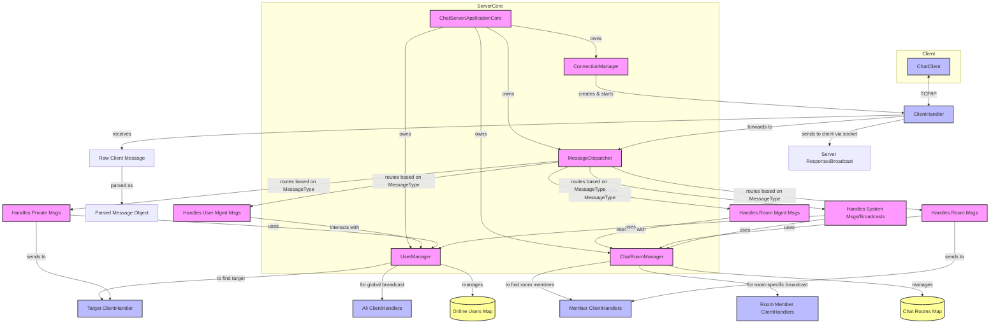

# WebChat 解耦与架构重构计划

## 1. 目标

1.  降低 `ChatServer` 和 `ClientHandler` 的复杂度与耦合度。
2.  实现更清晰的职责分离，将不同的业务关注点模块化。
3.  提高系统的可测试性和可扩展性。
4.  使代码更易于理解和维护。

## 2. 核心思路

引入几个核心服务/管理器来分担 `ChatServer` 的职责，并改进 `ClientHandler` 的消息处理方式。在当前单体应用内进行更清晰的模块化分层。

## 3. 建议的模块/服务划分

### 3.1. `ConnectionManager` (连接管理器)
*   **职责:**
    *   取代 `ChatServer` 中直接监听端口和接受 `Socket` 连接的部分。
    *   为每个新的客户端连接创建 `ClientHandler` 实例。
    *   管理 `ClientHandler` 的生命周期（启动）。
*   **交互:** `ConnectionManager` 将是服务器启动的入口点之一。

### 3.2. `UserManager` (用户管理器)
*   **职责:**
    *   管理在线用户（添加、移除、查询）。
    *   处理用户登录逻辑（用户名验证、唯一性检查）。
    *   维护用户名与对应 `ClientHandler` 的映射关系。
    *   广播用户上线/下线通知（可以委托给消息分发服务）。
*   **数据:** `ConcurrentHashMap<String, ClientHandler> onlineUsers`。
*   **交互:** `ClientHandler` 在处理登录请求时与 `UserManager` 交互。其他服务需要获取用户信息时也通过它。

### 3.3. `ChatRoomManager` (聊天室管理器)
*   **职责:**
    *   管理聊天室的生命周期（创建、销毁）。
    *   处理用户加入/离开聊天室的逻辑。
    *   维护聊天室列表以及每个聊天室的成员列表。
    *   广播聊天室相关的系统通知（如房间创建、用户加入/离开房间，可以委托给消息分发服务）。
*   **数据:** `ConcurrentHashMap<String, ChatRoom> chatRooms`。
*   **交互:** `ClientHandler` 在处理聊天室相关命令时与 `ChatRoomManager` 交互。

### 3.4. `MessageDispatcher` (消息分发器) / `MessageHandlerService` (消息处理服务)
*   **职责:**
    *   取代 `ClientHandler` 中庞大的 `switch` 语句。
    *   根据 `MessageType` 将传入的消息路由到相应的处理器或服务。
    *   处理私人消息的发送逻辑（查找目标用户并发送）。
    *   处理聊天室消息的广播逻辑（查找聊天室成员并发送）。
    *   处理系统消息的广播。
*   **交互:** `ClientHandler` 接收到消息后，将其交给 `MessageDispatcher`。`UserManager` 和 `ChatRoomManager` 在需要广播通知时，也可能通过 `MessageDispatcher`。

### 3.5. `ClientHandler` (精简后)
*   **职责:**
    *   维持与单个客户端的 `Socket` 连接和I/O流。
    *   从客户端读取 `Message` 对象。
    *   将读取到的 `Message` 对象传递给 `MessageDispatcher` 进行处理。
    *   通过其 `ObjectOutputStream` 向客户端发送 `Message` 对象。
    *   处理自身的生命周期（启动、关闭），并在关闭时通知 `UserManager` 和 `ChatRoomManager` (例如，通过事件或直接调用) 以清理用户状态。

### 3.6. `ChatServer` (或新的 `ApplicationCore` / `ServerOrchestrator`) (重构后)
*   **职责:**
    *   初始化并持有上述各个管理器/服务的实例。
    *   协调这些管理器/服务之间的必要交互（例如，在启动时启动 `ConnectionManager`）。
    *   提供服务器的整体启动和关闭逻辑。
    *   可以作为依赖注入的容器或服务定位器，让各个模块能获取到它们需要的其他模块的引用。

## 4. Mermaid 图示新架构

## 5. 重构步骤建议

1.  **定义接口:** 为新的管理器/服务（`UserManager`, `ChatRoomManager`, `MessageDispatcher`）定义清晰的Java接口。
2.  **创建实现类:**
    *   **`UserManagerImpl`**: 将 `ChatServer` 中与用户管理相关的逻辑迁移过来。
    *   **`ChatRoomManagerImpl`**: 将 `ChatServer` 中与聊天室管理相关的逻辑迁移过来。
    *   **`MessageDispatcherImpl`**: 实现消息路由逻辑。
3.  **重构 `ChatServer`:**
    *   移除已迁移的逻辑和数据。
    *   实例化并持有新的管理器对象。
    *   更新启动/关闭方法。
4.  **重构 `ClientHandler`:**
    *   移除对 `ChatServer` 的直接业务逻辑调用。
    *   将消息传递给 `MessageDispatcher`。
    *   登录逻辑与 `UserManager` 交互。
5.  **引入 `ConnectionManager`:** 将 `ServerSocket.accept()` 循环和 `ClientHandler` 创建逻辑移入。
6.  **依赖注入/服务定位:** 确保模块间能获取依赖实例。
7.  **测试:** 对每个模块进行单元测试和集成测试。
8.  **文档更新:** 更新 Memory Bank 中的 [`memory-bank/systemPatterns.md`](memory-bank/systemPatterns.md) 等相关文档。

## 6. 优点

*   **职责单一**
*   **低耦合**
*   **高内聚**
*   **易测试**
*   **易扩展**

## 7. 潜在挑战

*   初期重构工作量可能较大。
*   需要仔细设计模块间的接口和交互。